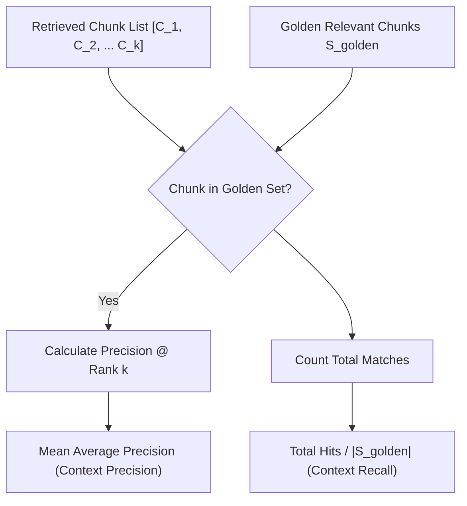

# genpark-context-precision-recall-rag-metric-skill

Agent Skill implementing **RAG Context Precision & Context Recall Evaluation** in 100% Python standard library.

## Architectural Flow

```mermaid
flowchart TD
    Retrieved["Retrieved Chunk List [C_1, C_2, ... C_k]"] --> Check{"Chunk in Golden Set?"}
    Golden["Golden Relevant Chunks S_golden"] --> Check
    Check -->|Yes| Prec["Calculate Precision @ Rank k"]
    Prec --> MAP["Mean Average Precision (Context Precision)"]
    Check --> Hits["Count Total Matches"]
    Hits --> Recall["Total Hits / |S_golden| (Context Recall)"]
```
